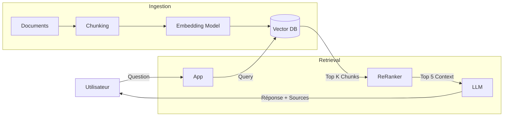

# 03 - Architecture Technique du RAG (Retrieval Augmented Generation)

Le RAG n'est pas juste "un prompt avec du contexte". C'est une architecture système complète. Voici comment on construit un RAG de production.

---

## 1. Pourquoi le RAG ? (Le Problème de l'Hallucination)
Les LLM sont figés dans le temps (leur date de fin d'entraînement).
*   **Problème** : Demandez à GPT-4 "Quel est le solde de mon compte aujourd'hui ?". Il ne sait pas.
*   **Solution** : On injecte la connaissance fraîche dans le prompt *avant* que le modèle ne réponde.

---

## 2. Le Pipeline d'Ingestion (ETL for AI)

Avant de pouvoir poser des questions, il faut préparer les données. C'est 80% du travail.

### A. Loading (Chargement)
Extraire le texte de sources variées : PDF, Docx, HTML, SQL.
*   *Défi* : Les PDF sont terribles (tableaux, colonnes, headers). Utiliser des outils comme `Unstructured` ou `PyMuPDF`.

### B. Chunking (Découpage) ✂️
On ne peut pas envoyer un livre entier (limite de Context Window). Il faut découper.
**Stratégies de Chunking :**
1.  **Fixed Size** : "Coupe tous les 500 caractères". (Brutal, risque de couper une phrase en deux).
2.  **Recursive Character Splitter** : "Essaie de couper aux paragraphes, sinon aux phrases, sinon aux mots". (Standard LangChain).
3.  **Semantic Chunking** : "Coupe quand le sujet change" (en utilisant les embeddings pour voir les sauts de distance sémantique).

**L'Overlap (Chevauchement)** : On garde toujours 10-20% du chunk précédent pour ne pas perdre le contexte à la frontière de coupure.

### C. Embedding & Indexing
On passe chaque chunk dans le modèle d'embedding (ex: `text-embedding-3-small`) et on stocke le vecteur dans la Vector DB.

---

## 3. Le Pipeline de Retrieval (Récupération)

Quand l'utilisateur pose une question, comment trouver le *meilleur* chunk ?

### A. Semantic Search (Dense Retrieval)
Utilise la similarité cosinus.
*   *Avantage* : Comprend le sens ("Voiture" trouve "Automobile").
*   *Inconvénient* : Rate parfois les mots-clés exacts (ex: un numéro de série spécifique "XJ-900").

### B. Keyword Search (Sparse Retrieval - BM25)
Le bon vieux moteur de recherche (type ElasticSearch). Compte la fréquence des mots.
*   *Avantage* : Trouve les termes exacts.
*   *Inconvénient* : Ne comprend pas les synonymes.

### C. Hybrid Search (Le Best Practice) 🏆
On combine les deux !
$$Score = \alpha \cdot Score_{Vector} + (1 - \alpha) \cdot Score_{BM25}$$
Cela garantit de trouver les concepts proches ET les références exactes.

---

## 4. Le Re-Ranking (L'étape de finition)

Souvent, la recherche vectorielle ramène 50 documents "à peu près" pertinents.
On utilise un **Cross-Encoder (Re-ranker)**. C'est un modèle plus lent mais très précis (ex: `Cohere Rerank`, `BGE-Reranker`) qui va lire la paire (Question, Document) et donner un score de pertinence précis.
On garde le Top 5 pour le context window du LLM.

---

## 5. L'Architecture Finale

## 6. Les limites actuelles
*   **"Lost in the Middle"** : Les LLM accordent plus d'importance au début et à la fin du contexte. Si la réponse est au milieu, ils peuvent la rater.
*   **Contexte Window infini ?** : Gemini 1.5 Pro a 1M tokens. Est-ce la fin du RAG ?
    *   Pas tout à fait. Chercher dans 1M tokens est lent et coûteux (€). Le RAG reste pertinent pour la latence et le coût.

