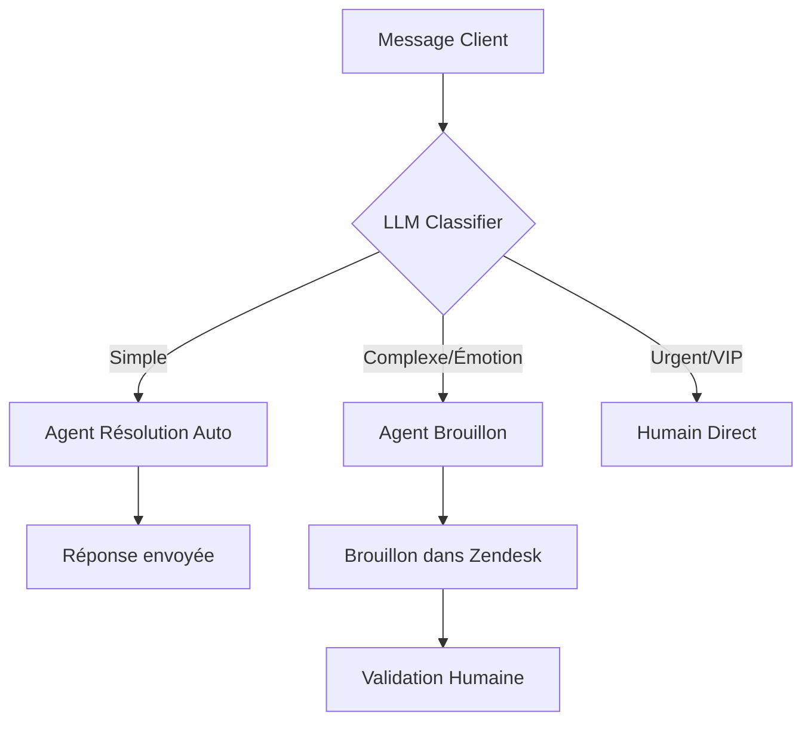

# 🎧 Cas d'Usage : Le Service Client Automatisé 2.0

## 🌍 Contexte & Enjeux
Le service client est historiquement un centre de coûts, souvent saturé de demandes répétitives (WISMO - "Where Is My Order"). L'automatisation classique par chatbots rigides a créé de la frustration. L'enjeu actuel est de passer à une IA "Agentique" capable non seulement de répondre, mais d'**agir** dans les systèmes (rembourser, replanifier), transformant le support en levier de fidélisation sans exploser les coûts humains.

Oubliez les chatbots "Q&A" qui ne font que recracher une FAQ. La nouvelle génération d'automatisaton de service client est **agentique** : elle agit.

---

## 🆚 Différence Fondamentale

| Chatbot Traditionnel (2020) | Agent Service Client (2024) |
|-----------------------------|-----------------------------|
| "Voici le lien pour réinitialiser le mot de passe." | "J'ai réinitialisé votre mot de passe, checkez vos mails." |
| Basé sur des mots-clés | Basé sur l'intention et le raisonnement |
| Connecté à rien | Connecté CRM, Stripe, Shopify, Base de Données |
| **Passif** | **Actif** |

---

## 🛠️ Scénario Type : L'e-commerce

Un client envoie : *"Mon colis est arrivé abîmé, je veux un remboursement."*

### Le Workflow Agentique
1.  **Analyse d'intention** : Détecte "Réclamation" + "Remboursement".
2.  **Extraction d'entités** : Cherche le n° de commande dans l'email ou demande "Quel est votre n° de commande ?".
3.  **Vérification (Outil)** : Interroge Shopify -> *Commande #12345, Livrée hier, Valeur 50€*.
4.  **Raisonnement (Politique)** :
    *   La politique dit : "Si < 100€ et client fidèle, remboursement immédiat."
    *   L'agent décide : "OK pour rembourser."
5.  **Action (Outil)** : Appelle l'API Stripe `refund_charge(id)`.
6.  **Réponse** : "Désolé pour ça ! Le remboursement de 50€ est déclenché. Gardez le produit."

### Résultat
*   **Temps de résolution** : 1 minute (vs 48h humain).
*   **Coût** : 0.05€ (vs 5€ humain).

---

## 🤖 L'Architecture Technique "Human-in-the-loop"

Tout ne peut pas être automatisé. Le secret est le **Triage Intelligent**.

### Le Concept de "Draft Mode"
Pour commencer sans risque, l'IA ne répond pas. Elle **prépare le brouillon** de réponse dans l'outil de ticket (Zendesk, Intercom).
L'humain n'a plus qu'à relire et cliquer sur "Envoyer". Gain de productivité : x3.

---

## 🔑 Les Pièges à Éviter

### 1. L'Hallucination de Politique
L'IA pourrait inventer une politique de retour ("On vous offre 200€ de dédommagement").
*   *Solution* : **RAG**. L'IA doit lire la politique PDF à chaque requête avant de répondre.

### 2. La Boucle Infinie
Le client ne comprend pas, l'IA répète la même chose.
*   *Solution* : Détecter la frustration (Analyse de Sentiment). Si sentiment < Neutre = Escalade Humaine immédiate.

### 3. Le Manque d'Empathie
Une réponse trop robotique énerve.
*   *Solution* : Configurer le **Persona** (Ton empathique, excuses sincères) et utiliser les données CRM ("Désolé Marie, je vois que c'est votre 2ème problème ce mois-ci...").

---

## 🏢 Ils l'utilisent déjà

*   **Klarna** : Le cas d'école. Leur assistant IA gère 2/3 des chats (2,3 millions de conversations), fait le travail de 700 agents temps plein, et a réduit le temps de résolution de 11 min à 2 min.
*   **Decathlon** : Utilise l'IA pour analyser les emails entrants, proposer des réponses types aux agents et détecter les clients "détracteurs" à rappeler en priorité.
*   **Shopify** : "Sidekick" aide les marchands à gérer leur boutique (remboursements, settings) par une simple conversation, sans chercher dans les menus.

## Conclusion
L'automatisation du service client ne vise pas à remplacer l'humain, mais à le débarrasser du **bruit** (Mots de commande, FAQ) pour qu'il se concentre sur les cas complexes nécessitant de l'intelligence émotionnelle.
