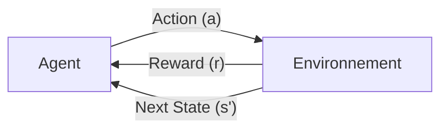

# 🎮 02. Reinforcement Learning (RL) : Les Bases Mathématiques

## 1. Le Paradigme Fondamental (MDP)

Le RL n'est pas de l'apprentissage supervisé (Input -> Label). C'est de l'apprentissage par l'essai-erreur.
On modélise le problème comme un **Processus de Décision Markovien (MDP)** : $(S, A, P, R, \gamma)$.

*   **S (State)** : État du monde (ex: pixels de l'écran Pong).
*   **A (Action)** : Ce que l'agent peut faire (ex: Haut, Bas).
*   **P (Transition)** : $P(s' | s, a)$ Probabilité d'arriver en $s'$ si je fais $a$ dans $s$.
*   **R (Reward)** : $R(s, a)$ Récompense immédiate (ex: +1 si la balle passe, -1 si je perds).
*   **$\gamma$ (Gamma - Discount Factor)** : Préférence pour le présent. Si $\gamma=0$, l'agent ne voit que l'instant t. Si $\gamma=1$, il pense infini.

---

## 2. L'Objectif : Maximiser le "Return"

L'agent ne veut pas juste le Reward immédiat $r_t$. Il veut la somme des rewards futurs $G_t$.
$$ G_t = R_{t+1} + \gamma R_{t+2} + \gamma^2 R_{t+3} + ... = \sum_{k=0}^{\infty} \gamma^k R_{t+k+1} $$

L'objectif est de trouver une **Politique $\pi(a|s)$** (Probabilité de jouer $a$ dans l'état $s$) qui maximise l'espérance de $G_t$.
$$ J(\pi) = \mathbb{E}_{\pi}[G_0] $$

---

## 3. Value Function & Q-Function

Comment l'agent sait-il si l'état $s$ est "bon" ?
Il a besoin d'évaluer la valeur des états.

### State-Value Function $V(s)$
"Si je suis ici, combien de points je vais gagner en moyenne d'ici la fin ?"
$$ V_{\pi}(s) = \mathbb{E}_{\pi} [G_t | S_t = s] $$

### Action-Value Function $Q(s, a)$
"Si je suis ici et que je fais l'action $a$, combien je vais gagner ?"
C'est la fonction la plus importante en Deep RL.
$$ Q_{\pi}(s, a) = \mathbb{E}_{\pi} [G_t | S_t = s, A_t = a] $$

---

## 4. L'Équation de Bellman (Le Cœur du RL)

C'est l'équation récursive qui permet de "résoudre" le RL. Elle dit que la valeur d'un état est égale à la récompense immédiate + la valeur de l'état suivant actualisée.

$$ V(s) = \max_a (R(s,a) + \gamma V(s')) $$

Cette équation permet à l'information de "remonter" du futur vers le présent. C'est la base de la Programmation Dynamique.

---

## 5. Exploration vs Exploitation

Le dilemme éternel.
*   **Exploitation** : Je joue l'action que je *pense* être la meilleure (Max Q).
*   **Exploration** : Je joue une action aléatoire pour voir si elle n'est pas mieux.

### Epsilon-Greedy ($\epsilon$-greedy)
*   Avec probabilité $1-\epsilon$ : Jouer $\max Q(s,a)$.
*   Avec probabilité $\epsilon$ : Jouer $Random$.
On commence avec $\epsilon=1$ (Exploration totale) et on diminue vers 0.01.

---

## Conclusion
Le RL est puissant car il ne demande pas de données étiquetées.
Cependant, il est instable et demande des millions d'interactions ("Sample Inefficiency").
C'est pourquoi on le combine souvent avec le Deep Learning (DQN, PPO) pour approximer les fonctions $V$ et $Q$ quand l'espace des états est trop grand (ex: pixels d'une image).
