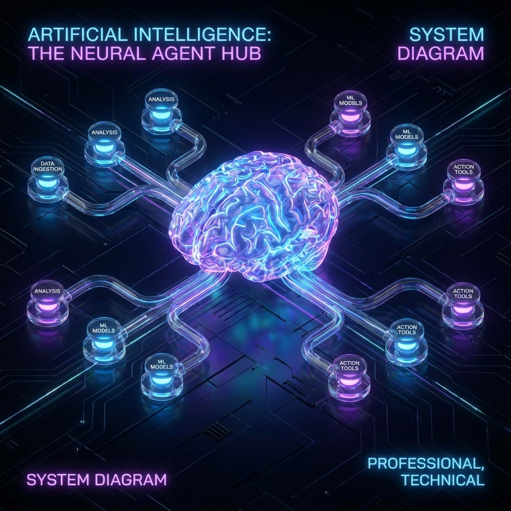
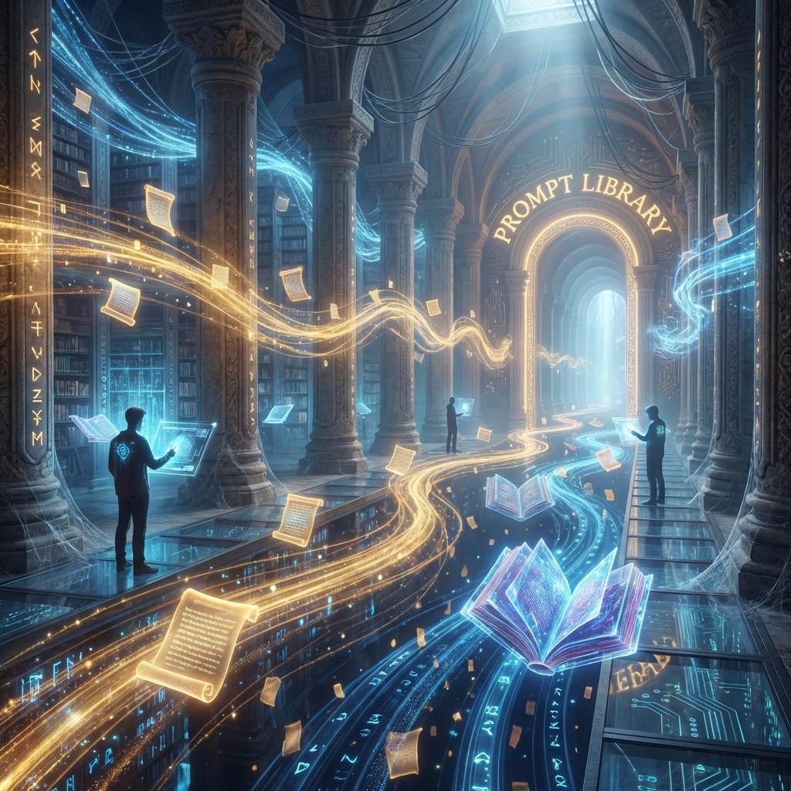

# 🧠 Bibliothèque IA - Méthode BMAD

> **Le système opérationnel complet pour maîtriser les LLMs, le Prompt Engineering et l'IA Agentique.**



---

## 🚀 Qu'est-ce que c'est ?

Cette bibliothèque est une **ressource tout-en-un** destinée aux développeurs, chefs de projet, et passionnés d'IA qui veulent :
- ✅ Comprendre les fondamentaux du Machine Learning et du Deep Learning
- ✅ Maîtriser l'art du Prompt Engineering (CO-STAR, XML Tags, etc.)
- ✅ Construire des Agents IA autonomes (ReAct, CRITIC, RAG...)
- ✅ Accéder à plus de **230 prompts prêts à l'emploi** par métier

---

## 📂 Structure du Projet

```
📁 Méthode_Guide_Prompts_Tuto_By_John_Nuwan_Moncel/
├── 📖 INDEX.md                    # Table des matières complète
├── 🧭 GUIDE_NAVIGATION.md         # Comment naviguer efficacement
├── 📁 Fondamentaux-ML-Classique/  # Bases du Machine Learning
├── 📁 Architecture-Deep-Learning/ # Neurones, Embeddings, RAG, Transformers
├── 📁 Concepts-Avances-ML-RL/     # Reinforcement Learning, RL avancé
├── 📁 Méthode BMAD/               # La méthode phare (+ 20 autres méthodes)
├── 📁 Bibliothèque-Prompts/       # 230+ prompts par métier et fonction
├── 📁 Cas-Usage/                  # 27 études de cas réels
├── 📁 Tutoriels/                  # Guides pratiques avec code Python
├── 📁 Guides/                     # Cheatsheets, Glossaire, Troubleshooting
└── 📁 assets/images/              # Illustrations et schémas
```

---

## 🌐 Interface Web

Ce projet inclut une **interface de lecture interactive** (HTML/CSS).

### Lancer l'interface :
```bash
# Windows
START-SERVER.bat

# Puis ouvrez votre navigateur sur :
http://localhost:8080
```



---

## ⭐ Points Forts

| Fonctionnalité | Description |
| :--- | :--- |
| **22 Méthodes IA** | BMAD, ReAct, CoT, RAG, CRITIC, ToT, etc. |
| **230+ Prompts** | Classés par métier (Tech, Business, Support, Marketing...) |
| **27 Cas d'Usage** | IA Vocale, Vibe Coding, Agents, Sécurité... |
| **Design Premium** | Interface Glassmorphism & illustrations HD |
| **Local First** | Tutoriel pour faire tourner l'IA sur votre PC (Ollama) |

---

## 🛠️ Technologies Utilisées

- **Documentation** : Markdown
- **Viewer** : HTML5, CSS3 (Glassmorphism), JavaScript
- **Rendering** : Marked.js (Markdown → HTML)
- **Math** : MathJax (Formules LaTeX)

---

## 📜 Licence

Ce projet est sous licence **MIT** — Utilisation libre, modification libre, partage libre.

---

## 👤 Auteur

**John Nuwan Moncel**

*"L'IA n'est pas là pour nous remplacer, mais pour amplifier notre intelligence."*

---

## 🤝 Contribution

Les contributions sont les bienvenues ! Si vous avez des prompts, des cas d'usage ou des corrections à proposer, n'hésitez pas à ouvrir une Pull Request ou une Issue.
